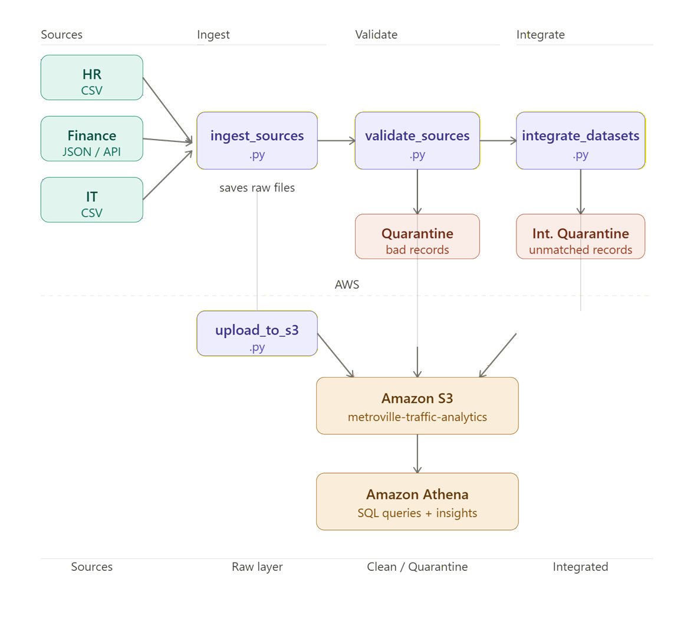
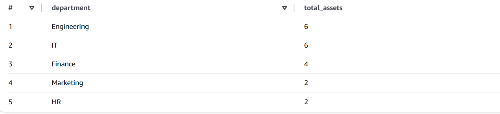
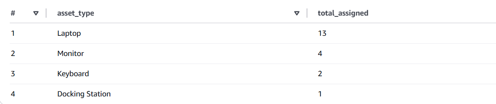
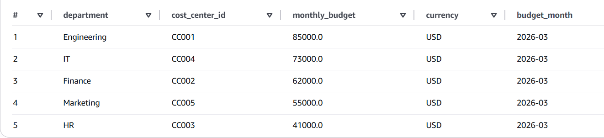
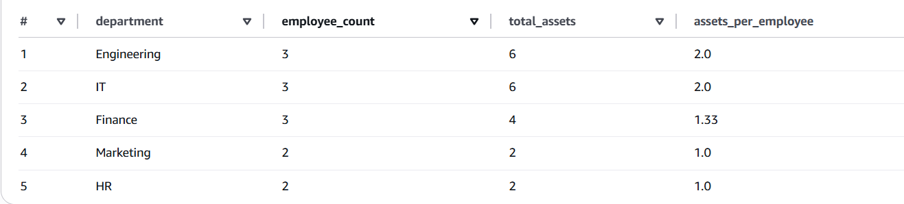
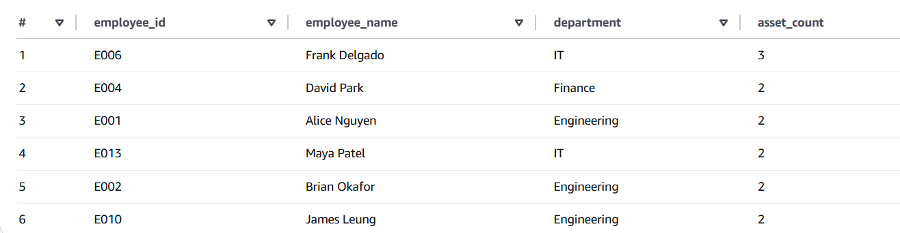
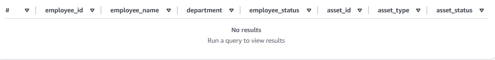
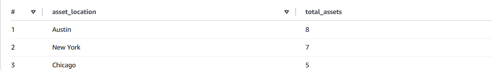

# 🏢 Enterprise Data Integration Pipeline (AWS)

## 📌 Overview

This project builds a portfolio-ready enterprise data integration pipeline that ingests data from three heterogeneous source systems, validates and standardizes each source, integrates them into a single analytics-ready dataset, uploads all data layers to Amazon S3 using boto3, and queries the final output in Amazon Athena.

This pipeline enables analysis of workforce assets, budget allocation, and resource utilization across departments.

The pipeline simulates a real-world scenario where HR, Finance, and IT data must be unified to support operational decision-making around workforce assets and departmental budgets.

---

## 🎯 Project Goal

Demonstrate end-to-end ETL/ELT pipeline thinking by:

- ingesting data from multiple source formats (CSV and JSON)
- applying source-level data validation and quarantine logic
- integrating data across systems using key-based joins
- handling referential integrity at the integration layer
- uploading all data layers to S3 using boto3
- querying the integrated output in Athena for business insights

---

## 🏗️ Architecture



Note: The S3 bucket name `metroville-traffic-analytics` is reused across multiple projects in this portfolio for consistency and to simulate a shared data lake environment. Each project is isolated using distinct folder paths.

---

## ☁️ Why AWS?

Amazon S3 and Athena were used to simulate a scalable, serverless analytics pipeline. This setup allows querying large integrated datasets efficiently without managing infrastructure, and mirrors how real enterprise data platforms operate.

---

## 📂 Source Systems

### HR Source
- Format: CSV
- Fields: `employee_id`, `employee_name`, `department`, `location`, `manager_id`, `hire_date`, `status`
- Represents the master employee record system

### Finance Source
- Format: JSON (simulated as a JSON-based API response stored locally to mimic real API ingestion)
- Fields: `cost_center_id`, `department`, `monthly_budget`, `currency`, `budget_month`, `last_updated`
- Finance data originates as a JSON-based API response. During ingestion it is persisted to the raw layer in CSV format to ensure consistency across storage and querying in Athena.

### IT Source
- Format: CSV
- Fields: `asset_id`, `employee_id`, `asset_type`, `assigned_date`, `status`, `location`
- Represents IT asset assignments linked to employees

---

## 🧱 Pipeline Flow

### 1. Ingestion
`ingest_sources.py` reads all three source files and saves timestamped raw copies to the local `Data/Raw/` layer. Raw data is never modified after this point. Each source is processed independently, allowing the pipeline to continue even if one source fails.

### 2. Validation
`validate_sources.py` reads the latest raw files and applies source-level validation rules to each system. Valid records go to `Data/Clean/`. Invalid records go to `Data/Quarantine/` with a `rejection_reason` column attached.

### 3. Integration
`integrate_datasets.py` reads the latest clean files and performs two joins:

- Join 1: IT → HR on `employee_id` — IT records with no matching HR employee are quarantined at the integration layer with `rejection_reason = unmatched_employee_id`
- Join 2: matched HR+IT → Finance on `department` — if no Finance match exists, the record is kept and Finance fields are set to null

The final output is saved to `Data/Integrated/`.

### 4. S3 Upload
`upload_to_s3.py` uploads the latest timestamped file from each local data layer to the correct S3 prefix under `project4-enterprise-integration/`.

### 5. Athena Querying
External tables are created in Athena over the S3 data. Validation and analysis queries are run against the integrated output.

---

## ✅ Validation Rules

### HR
- `employee_id` is required
- `department` is required
- `hire_date` must be a valid date
- `employee_id` must be unique

### Finance
- `department` is required
- `monthly_budget` must be numeric and greater than 0
- `budget_month` is required
- `department` + `budget_month` must be unique

### IT
- `asset_id` is required
- `employee_id` is required
- `assigned_date` must be a valid date
- `asset_id` must be unique

### Integration
- IT records with no matching `employee_id` in HR are quarantined as `unmatched_employee_id`

---

## 🔢 Validation Results

| Source | Total records | Valid | Quarantined |
|--------|--------------|-------|-------------|
| HR | 19 | 16 | 3 |
| Finance | 8 | 6 | 2 |
| IT | 24 | 21 | 3 |
| Integration | 21 | 20 | 1 |

Integration-level quarantine captures cross-system mismatches (e.g., IT records without matching HR employees). This is a separate category of rejection from source-level validation.

---

## 📊 Analysis & Insights

### 1. Assets per Department


Engineering and IT lead with 6 assets each. HR and Marketing have the lowest asset counts at 2 each.

**Business decision:** Before approving new hardware purchase requests, conduct an asset audit of Engineering and IT first. Departments with the highest asset counts are the most likely to have surplus or underutilised devices that can be reallocated.

---

### 2. Asset Type Distribution


Laptops account for 13 of 20 assets (65%). Monitors are second at 4. Keyboards and docking stations make up the remainder.

**Business decision:** Laptops represent the dominant hardware category. Negotiating a volume procurement agreement with a single laptop vendor could reduce unit cost significantly compared to ad hoc purchasing across multiple vendors.

---

### 3. Monthly Budget per Department


Engineering holds the largest monthly budget at $85,000. HR has the smallest at $41,000. All budgets are in USD for March 2026.

**Business decision:** Cross-reference budget allocation against headcount and asset counts. Engineering and IT carry the highest budgets and the highest asset loads — this alignment is expected. Marketing carries $55,000 with only 2 employees and 2 assets, which may warrant a budget review.

---

### 4. Headcount vs Assets per Department


Engineering and IT both show a 2.0 assets-per-employee ratio. Finance is at 1.33. Marketing and HR are at 1.0.

**Business decision:** Use the 2.0 ratio as the internal benchmark for technical departments. Any future provisioning request above this threshold should require additional justification before approval. This creates a data-driven standard for hardware allocation.

---

### 5. Employees with Multiple Assets


6 employees have more than one asset assigned. Frank Delgado (IT) holds the most at 3 assets. 5 others hold 2 assets each.

**Business decision:** Review multi-asset employees as the first candidates for asset reclamation before procuring new hardware for new hires. Secondary devices that are underused can be reassigned directly, reducing onboarding procurement costs.

---

### 6. Assets Assigned to Inactive Employees


No assets are currently assigned to inactive employees in the integrated dataset. Rachel Burns (E016) was marked inactive in HR but had no IT assets assigned, so no records surfaced here.

**Business decision:** While no immediate action is required, this query should be run regularly as part of a recurring asset audit. Assets held by departing or inactive employees represent a direct, avoidable procurement cost if not reclaimed promptly.

---

### 7. Assets per Location


Austin leads with 8 assets, followed by New York with 7 and Chicago with 5.

**Business decision:** Austin carries the highest asset inventory. If new hires are onboarding in Chicago, assets can be redistributed from Austin before triggering a central procurement request, reducing both lead time and shipping costs.

---

## 🗂️ Data Layers

| Layer | Location | Description |
|-------|----------|-------------|
| Raw | `Data/Raw/` | Timestamped copies of source data, never modified |
| Clean | `Data/Clean/` | Records that passed source-level validation |
| Quarantine | `Data/Quarantine/` | Rejected records with rejection reasons attached |
| Integrated | `Data/Integrated/` | Final analytics-ready joined dataset |

---

## ☁️ AWS Structure

```
s3://metroville-traffic-analytics/
└── project4-enterprise-integration/
    ├── raw/
    │   ├── hr/
    │   ├── finance/
    │   └── it/
    ├── clean/
    │   ├── hr/
    │   ├── finance/
    │   └── it/
    ├── quarantine/
    │   ├── hr/
    │   ├── finance/
    │   ├── it/
    │   └── integration/
    └── integrated/
```

---

## 🗃️ Athena Tables

| Table | Description |
|-------|-------------|
| `hr_raw` | Raw HR records |
| `finance_raw` | Raw Finance records (persisted as CSV from JSON source) |
| `it_raw` | Raw IT records |
| `hr_clean` | Validated HR records |
| `finance_clean` | Validated Finance records (persisted as CSV from JSON source) |
| `it_clean` | Validated IT records |
| `integrated_department_assets` | Final integrated analytics table |

---

## 🛠️ Tech Stack

- Python
- Amazon S3
- Amazon Athena
- SQL
- boto3

---

## 📁 Project Structure

```
Project 4 - Enterprise Integration/
├── Sources/
│   ├── hr_source.csv
│   ├── finance_source.json
│   └── it_source.csv
├── Data/
│   ├── Raw/
│   ├── Clean/
│   ├── Quarantine/
│   └── Integrated/
├── Scripts/
│   ├── Python/
│   │   ├── run_pipeline.py
│   │   ├── ingest_sources.py
│   │   ├── validate_sources.py
│   │   ├── integrate_datasets.py
│   │   └── upload_to_s3.py
│   └── SQL/
│       ├── 01_create_database.sql
│       ├── 02_create_raw_tables.sql
│       ├── 03_create_clean_tables.sql
│       ├── 04_create_integrated_table.sql
│       ├── 05_validation_queries.sql
│       └── 06_analysis_queries.sql
├── Images/
├── .gitignore
├── requirements.txt
└── README.md
```

---

## 🔁 How to Run

### Run the full pipeline in one command
```bash
python Scripts/Python/run_pipeline.py
```

This runs all four scripts in order. If any step fails the pipeline stops immediately to prevent downstream scripts from running on bad data.

### Or run each step manually
1. `python Scripts/Python/ingest_sources.py`
2. `python Scripts/Python/validate_sources.py`
3. `python Scripts/Python/integrate_datasets.py`
4. `python Scripts/Python/upload_to_s3.py`

### AWS setup
5. Create Athena tables using SQL files 01 through 04
6. Run validation and analysis queries using SQL files 05 and 06

### Install dependencies
```bash
pip install -r requirements.txt
```

---

## 🤝 A Note on AI-Assisted Development

This project was built with the assistance of AI tools to accelerate data generation and script scaffolding, allowing focus to remain on pipeline design, validation logic, integration architecture, and business analysis — which are the core objectives of the project.

All pipeline logic, validation rules, integration decisions, and business insights were defined, reviewed, and understood before implementation. AI was used as a productivity tool, not a replacement for engineering judgment.

---

## ⚠️ Limitations

- Source data is synthetic and may not reflect full real-world variability
- Finance data is simulated as a JSON-based API response stored locally to mimic real API ingestion
- No scheduling or orchestration — pipeline is run manually
- Single run per session — no incremental load logic in Version 1

---
